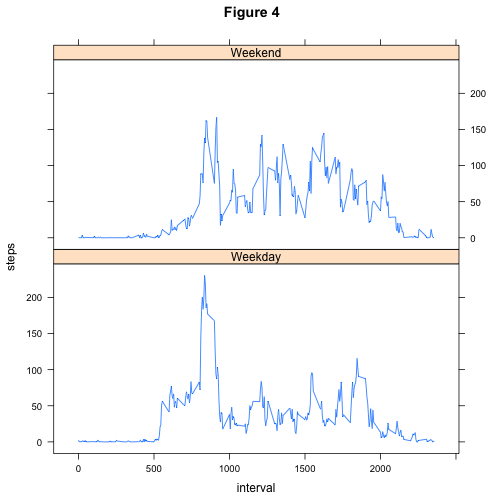

Reproducible Research: Peer Assessment 1
========================================

### Data
This project draws from activity data on an anonymous individual collected by a samsung galaxy phone. The data can be downloaded from:  
* **Dataset**: [Activity Monitoring Data](https://d396qusza40orc.cloudfront.net/repdata%2Fdata%2Factivity.zip) [52k]  

The variables included in this dataset are: 
* **steps** : (Integer) number of steps taken in a 5-minute interval  
* **date** : (Factor) date on which the measurement was taken in YYYY-MM-DD format  
* **interval** : (Integer) 5-minute interval in which the measurement was taken  

The dataset is stored in a comma-separated-value (CSV) file and there are a total of 17,568 observations in this dataset.

### Description
This project performs and displays the following steps:

1. Loading and preprocessing the data  
2. Finding the mean and median total number of steps taken per day  
3. Finding the average daily activity pattern  
4. Imputing missing values and recalculating the mean and median total number of steps taken per day  
5. Exploring how the average daily activity pattern differs based on weekdays and weekends  


### 1. Loading and preprocessing the data
First we load the activity data into memory. Set the working directory to the same location as the dataset. 

```r
as0 <- read.csv("activity.csv")
```
The date variable consists of factors. We would prefer the values to be dates. We can easily transform the column using the as.Date function.

```r
as0 <- transform(as0, date = as.Date(date))
head(as0)
```

### 2. What is mean total number of steps taken per day?
In order to determine the central tendency of steps taken per day first we find the total number of steps taken each day. The totals are illustrated in Figure 1 below.

```r
as1 <- with(as0, tapply(steps, date, sum, na.rm=T))
as1 <- data.frame(names(as1), as1)
colnames(as1) <- c("date", "steps")
rownames(as1) <- 1:nrow(as1)
as1 <- transform(as1, date=as.Date(date))
with(as1, plot(date, steps, type="h",  main="Figure 1", xlab="date (2012)"))  
```

 

With the total number of steps taken each day the mean and median can be calculated.

```r
mean <- round(mean(as1$steps), digits=2)
median <- median(as1$steps)
```
Mean total number of steps taken per day = 9354.23

Median total number of steps taken per day = 10395

### 3. What is the average daily activity pattern?
We can construct a plot of the individual's average daily activity pattern by averaging across intervals. This pattern is illustrated in Figure 2 below.

```r
as2 <- with(as0, tapply(steps, interval, mean, na.rm=T))
as2 <- data.frame(names(as2), as2)
colnames(as2) <- c("interval", "avgsteps")
rownames(as2) <- 1:nrow(as2)
as2 <- transform(as2, interval=as.numeric(as.character(interval)))
plot(as2, type="l", main="Figure 2", xlab="Interval", ylab="Average Steps")
```

 

Using the average daily activity pattern we can determine the 5-minute interval that, on average, contains the maximum number of steps.

```r
max <- as2$interval[which.max(as2$avgsteps)]
```
The 5-minute interval that, on average, contains the maximum number of steps is **835**.

### 4. Imputing missing values

```r
missing <- sum(is.na(as0$steps))
```
The total number of missing values: **2304**

We will replace all missing values with the average number of steps for that 5-minute interval. This assumes that the activity occuring during the missing times likely followed the individual's average daily activity pattern. The total number of steps taken each day with the imputed missing values is found below in Figure 3.

```r
as0 <- transform(as0, avg_for_interval = rep(as2$avgsteps, nrow(as0)/nrow(as2)))
as0$steps <- with(as0, replace(steps, is.na(steps), avg_for_interval[is.na(steps)]))
as3 <- with(as0, tapply(steps, date, sum))
as3 <- data.frame(names(as3), as3)
colnames(as3) <- c("date", "steps")
rownames(as3) <- 1:nrow(as3)
as3 <- transform(as3, date=as.Date(date))
with(as3, plot(date, steps, type="h",  main="Figure 3", xlab="date (2012)"))
```

 

With the new total number of steps taken each day we can examine whether the mean and median are different due to the imputed missing values.

```r
library(xtable)
new_mean <- mean(as3$steps)
new_median <- median(as3$steps)
tbl <- data.frame(Original = c(mean, median), Imputed = c(new_mean, new_median))
rownames(tbl) <- c("Mean", "Median")
tbl <- xtable(tbl)
print(tbl, type="html", align="r", display="f")
```

<!-- html table generated in R 3.1.2 by xtable 1.7-4 package -->
<!-- Sun Dec 14 20:09:56 2014 -->
<table border=1>
<tr> <th>  </th> <th> Original </th> <th> Imputed </th>  </tr>
  <tr> <td align="right"> Mean </td> <td align="right"> 9354.23 </td> <td align="right"> 10766.19 </td> </tr>
  <tr> <td align="right"> Median </td> <td align="right"> 10395.00 </td> <td align="right"> 10766.19 </td> </tr>
   </table>

### 5. Are there differences in activity patterns between weekdays and weekends?
To examine the different activity patterns on weekdays and weekends we create a new factor variable based on whether the date of the measurement was a weekday and weekend. Then we calculate the average steps taken during each 5-minute interval grouped by weekday and weekend measurements. Finally, we plot the daily activity patterns for weekends and weekdays in two papanels in Figure 4 below.

```r
as4 <- transform(as0, day=weekdays(date))
wd <- function(x) {
        if (x=="Saturday" | x=="Sunday") {
                "Weekend"
        }
        else {
                "Weekday"
        }
}
as4 <- transform(as4, day=sapply(day, wd))
avg_intervals <- data.frame(with(as4, tapply(steps, list(interval, day), mean, na.rm=T)))
avg_intervals <- transform(avg_intervals, interval = as.numeric(rownames(avg_intervals)))
library(tidyr)
avg_intervals <- gather(avg_intervals, day, steps, -interval)
xyplot(steps ~ interval | day, data=avg_intervals, type="l", layout=c(1,2), main="Figure 4")
```

 
